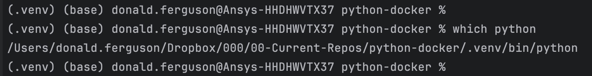
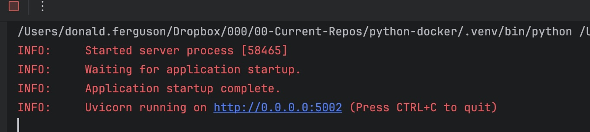
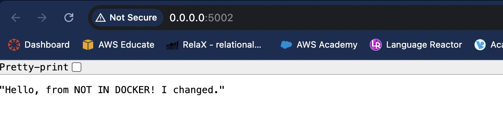
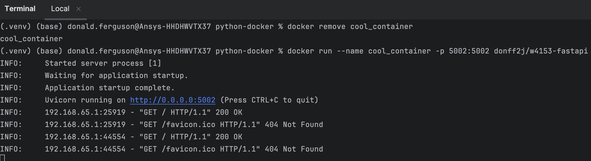

# W4153 - Cloud Computing: FastAPI-python-docker

## Overview

This is a simple, end-to-end example of a simple microservice implemented using FastAPI
and running in a Docker container. The example also documents the steps to deploy on Amazon EC2 and
Google Cloud Compute Engine.

There are many, many other online tutorials. 


## The Flow

This example/tutorial goes through three steps:
1. Unit test the simple FastAPI application.
2. Deploy and test the application using Docker on the laptop/desktop.
3. Deploy and test the application using Docker on a cloud service provider. There are two sub-examples:
   4. Amazon Web Services
   5. Google Cloud Platform


## Simple Unit Test

The first step is to create a python virtual environment and activate it. Most Python integrated development
environments can create python virtual environments. Otherwise, you can follow online instructions to create and
activate a virtual environment.

Open a terminal window in the project directory and make sure that the command prompt is in the virtual
environment. An example from PyCharm on my Mac is:



This shows that python is not the system python and in a virtual environment.

Install the python dependencies.
```
pip install -r requirements.txt
```

Run the application ```app.py.``` This should produce a terminal output similar to



Opening the ```http``` URL in a browser should produce something like




## Docker

You have to install Docker desktop and start the local demon. You will also have to log into Docker Hub.
For this example, I created an access token. At the command prompt, I entered
```
docker login -u donff2j
```

I enter the access token from Docker Hub as the password.

__Note to old professor:__ The local file ```.secrets```
contains the information, and is not pushed to GitHub.)

```Dockerfile``` defines the container and its contents. There are comments in the file.<br><br>

```
docker build -t donff2j/w4153-fastapi .
```
builds the container image using the Docker file. ```donff2j``` is
the Docker Hub ID, and I am tagging the container for the container repo and name.<br><br>

```docker images``` will list all of the images.<br><br>

```
docker run --name cool_container -p 5002:5002 donff2j/w4153-fastapi
```
runs the container in the foreground. This
This will show the console. The option ```-p``` exposes the container port 5002 at the host computer's port 5002. The
The option ```--name cool_container``` assign a name that you can use to perform operations on the container.

Opening the browser and navigating to ```localhost:5002``` will show the same material as previously. The message
will be slightly different and read ```Hello, from DOCKER! I changed.``` This is because the Dockerfile set some
environment variables, including ```ENV WHEREAMI=DOCKER.``` This is a simple example of the 12 Factor App principle
[III. Config -- Store config in the environment.](https://12factor.net/) We will use this principle in later
examples, for example to set database URLs and authentication information.

The console shows log messages when you access from the browser.



You can stop the container using ```CTL-C.``` If you want to run the container disconnected and in
the background, you can use the commands
```
docker remove cool_container

docker run -d --name cool_container -p 5002:5002 donff2j/w4153-fastapi
```

The last command will return a complex string similar to
```
ed5a34e9b84af58a0d507f5652fcec349678e2207681fdc1c70f0d1bbc911c35.
```

You can stop the container with
```aiexclude
docker stop cool_container
```

My computer is an ARM based Mac. I will use an x86 system on AWS EC2 and GCP. So, I need to build an x86
version of the container.

```
docker buildx build --platform linux/amd64 -t donff2j/fastapi:x86 --load .
```

Push the container to the hub.

```aiexclude
docker push donff2j/fastapi:x86 
```

## EC2

- I used an Amazon Linux instance.


- I followed this example: https://medium.com/appgambit/part-1-running-docker-on-aws-ec2-cbcf0ec7c3f8
  - ```sudo yum update -y```
  - ```sudo service docker start```
  - ```sudo usermod -a -G docker ec2-user```
  - I also installed Git.


- I cloned the project instead of pulling the container because my Mac is ARM.
  - docker build  . -f cool


- There is a way to "build" on ARM for an Intel chipset. I am lazy.


- I built the Dockerfile and then used ```curl localhost:5001```


- I now need to modify the service group to get to port 5001. Go through the instance to security group and add a rule.


- Go into the console and get the EC2 instances public IP address. You can now access the app on 5001.


- Pull the Docker container ```docker pull donff2/e6156-flask```


- I used an Amazon Linux instance.
- 

## Some Helpful Commands

- Kill a process on a port (MacOS): ```lsof -i tcp:3000```